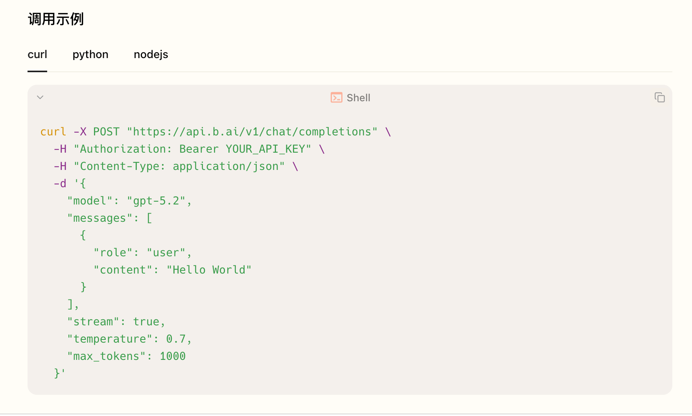

# free-AI-free-token

免费 LLM 供应商、免费模型、API 接入文档集中库。

这个项目的核心不是做一个临时清单，而是沉淀一套可复制的供应商接入规格：每个免费 LLM 供应商一个独立目录，目录内必须包含官网信息、免费模型、接入地址、接入步骤，以及面向 Claude Code、OpenClaw、OpenCode、Codex、Hermes 的固定接入文档。

## 免费供应商

<table>
<colgroup>
<col width="8%">
<col width="8%">
<col width="30%">
<col width="8%">
<col width="36%">
<col width="10%">
</colgroup>
<thead>
<tr><th>供应商</th><th>目录</th><th>免费模型</th><th>接入地址</th><th>证据</th><th>状态</th></tr>
</thead>
<tbody>
<tr><td>Agnes AI</td><td><a href="providers/agnes/">providers/agnes</a></td><td><code>agnes-2.0-flash</code>、<code>agnes-2.5-flash</code>、<code>agnes-image-2.0-flash</code>、<code>agnes-image-2.1-flash</code>、<code>agnes-video-v2.0</code></td><td><code>https://apihub.agnes-ai.com/v1</code></td><td>-</td><td>已整理，全部实测</td></tr>
<tr><td>智谱 GLM</td><td><a href="providers/zhipu-glm/">providers/zhipu-glm</a></td><td><code>glm-4.7-flash</code>、<code>glm-4-flash-250414</code>、<code>glm-4.6v-flash</code>、<code>glm-4.1v-thinking-flash</code>、<code>glm-4v-flash</code>、<code>cogview-3-flash</code>、<code>cogvideox-flash</code></td><td><code>https://open.bigmodel.cn/api/paas/v4/</code></td><td>-</td><td>已整理，待实测</td></tr>
<tr><td>商汤 SenseNova</td><td><a href="providers/sensenova/">providers/sensenova</a></td><td><code>sensenova-6.7-flash-lite</code>、SenseNova U1 Fast</td><td><code>https://token.sensenova.cn/v1</code></td><td>-</td><td>已整理，待实测</td></tr>
<tr><td>OpenRouter</td><td><a href="providers/openrouter/">providers/openrouter</a></td><td><code>*:free</code> 模型</td><td><code>https://openrouter.ai/api/v1</code></td><td>-</td><td>已整理，待实测</td></tr>
<tr><td>B.AI</td><td><a href="providers/b-ai/">providers/b-ai</a></td><td><code>DeepSeek-V4-Flash</code>、<code>DeepSeek-V4-Flash-Vision-Exp</code>、<code>Hy3</code></td><td><code>https://api.b.ai/v1</code></td><td><a href="providers/b-ai/assets/b-ai-free-models.png"></a><br><a href="providers/b-ai/assets/b-ai-api-example.png"></a></td><td>已整理，免费标记已截图，待实测</td></tr>
<tr><td>模板</td><td><a href="providers/_template/">providers/_template</a></td><td>待填写</td><td>待填写</td><td>-</td><td>模板</td></tr>
</tbody>
</table>

## 仓库架构

```text
free-AI-free-token/
├── README.md
├── .gitignore
├── docs/
│   ├── architecture.md
│   └── contribution-guide.md
├── providers/
│   └── _template/
│       ├── README.md
│       ├── official-links.md
│       ├── models.md
│       ├── api.md
│       └── integrations/
│           ├── claude-code.md
│           ├── openclaw.md
│           ├── opencode.md
│           ├── codex.md
│           └── hermes.md
└── scripts/
    └── validate-layout.sh
```

## 供应商目录规则

每个供应商必须放在 `providers/<provider-slug>/` 下，例如：

```text
providers/groq/
providers/openrouter/
providers/google-ai-studio/
```

每个供应商目录必须从 `providers/_template/` 复制，不允许临时自由发挥。这样后续用户接入任何一家免费 LLM 时，都能在同样的位置找到同样类型的信息。

## 采集边界

只收集公开、可追溯、可接入的信息：

- 官网和官方文档入口
- API key 获取入口
- 接入地址
- 免费模型
- OpenAI-compatible 状态
- Claude Code、OpenClaw、OpenCode、Codex、Hermes 接入方式
- 核验日期和核验状态

不收录营销介绍、使用感受、作者信息、账号信息、截图中的敏感字段或任何非公开内容。

## 固定文档模板

每个供应商目录必须包含：

| 文件 | 作用 |
| --- | --- |
| `README.md` | 供应商总览、适用场景、快速开始 |
| `official-links.md` | 官网、控制台、文档、价格、状态页、模型列表等来源 |
| `models.md` | 免费模型、模型名、能力、限制 |
| `api.md` | 接入地址、鉴权方式、OpenAI 兼容性、接入步骤 |
| `integrations/claude-code.md` | 接入 Claude Code |
| `integrations/openclaw.md` | 接入 OpenClaw |
| `integrations/opencode.md` | 接入 OpenCode |
| `integrations/codex.md` | 接入 Codex |
| `integrations/hermes.md` | 接入 Hermes |

## 新增供应商流程

1. 复制模板：

   ```bash
   cp -R providers/_template providers/<provider-slug>
   ```

2. 填写所有 Markdown 文档。
3. 在根 README 的「免费供应商」中新增入口。
4. 运行结构校验：

   ```bash
   ./scripts/validate-layout.sh
   ```

5. 在文档中保留官方来源链接和核验日期。

## 事实要求

免费模型、接入地址、模型名、是否 OpenAI-compatible 都可能变化。写入仓库前必须以官方文档、原文或控制台页面为准，并在对应文档中记录：

- 官方来源链接
- 核验日期
- 核验状态
- API endpoint
- model

不确定的信息必须标记为 `待核验`，不要写成确定结论。
