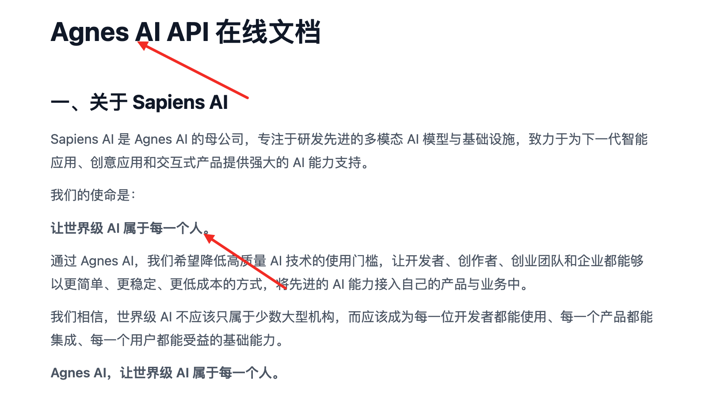
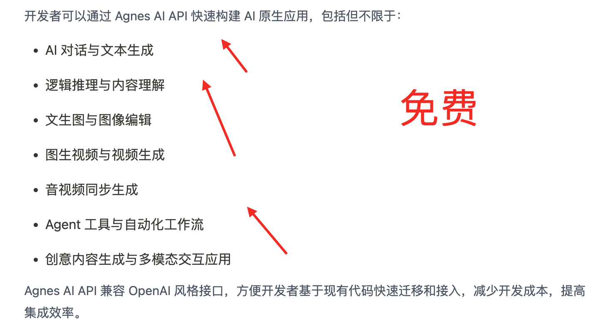
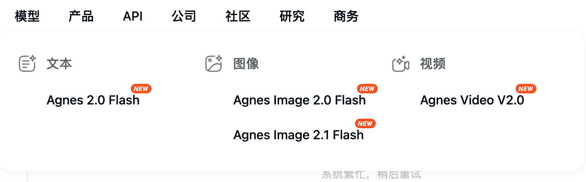
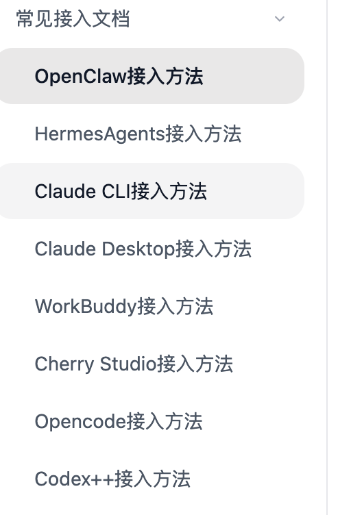

# Agnes AI

## 当前状态

- 文档状态：已整理，待实测
- API 状态：官网文档已核对，待实测
- 免费模型状态：官网文档与截图已核对，待实测
- 最后核验日期：2026-06-24

## 一句话说明

Agnes AI 是 Sapiens AI 提供的免费 AI API 平台，支持 OpenAI 风格接口，面向对话、文本生成、图像、视频、音视频同步、Agent 工具等场景。

## 快速开始

1. 打开 Agnes AI 官网文档。
2. 注册或登录 Agnes AI。
3. 创建 API key。
4. 使用 Base URL `https://apihub.agnes-ai.com/v1`。
5. 选择 Agnes 免费模型。
6. 在客户端中配置 Base URL、API key、模型名。

## 核心信息

- 官网：https://agnes-ai.com/
- 文档：https://agnes-ai.com/doc
- 接入地址：https://apihub.agnes-ai.com/v1
- Chat completions endpoint：`https://apihub.agnes-ai.com/v1/chat/completions`
- 是否 OpenAI-compatible：是
- 免费模型：`agnes-2.0-flash`、`agnes-image-2.0-flash`、`agnes-image-2.1-flash`、`agnes-video-v2.0`

## 目录

- [官方链接](official-links.md)
- [模型列表](models.md)
- [API 接入](api.md)
- [Claude Code 接入](integrations/claude-code.md)
- [Claude CLI 接入](integrations/claude-cli.md)
- [Claude Desktop 接入](integrations/claude-desktop.md)
- [OpenClaw 接入](integrations/openclaw.md)
- [OpenCode 接入](integrations/opencode.md)
- [Codex 接入](integrations/codex.md)
- [Codex++ 接入](integrations/codex-plus-plus.md)
- [Hermes 接入](integrations/hermes.md)
- [WorkBuddy 接入](integrations/workbuddy.md)
- [Cherry Studio 接入](integrations/cherry-studio.md)
