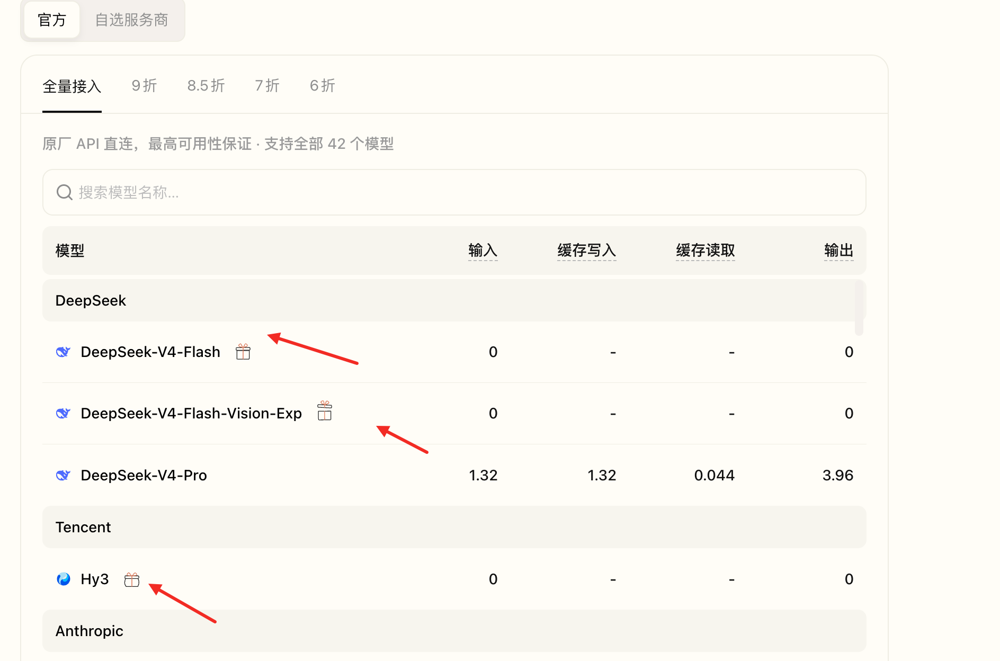

# B.AI

## 当前状态

- 文档状态：已整理，待实测
- API 状态：已从官方调用示例整理，待实测
- 免费模型状态：截图确认
- 接入文档状态：待核验
- 最后核验日期：2026-08-24

## 一句话说明

B.AI 提供兼容 Chat Completions 调用形式的模型 API；本目录只收录 `chat.b.ai/key` 页面截图中标记为“赠送”的模型。

## 免费模型

- `DeepSeek-V4-Flash`
- `DeepSeek-V4-Flash-Vision-Exp`
- `Hy3`

## 快速开始

1. 打开 [B.AI API key 页面](https://chat.b.ai/key)。
2. 创建或复制 API key。
3. 设置 Base URL `https://api.b.ai/v1`。
4. 选择上面的免费模型。
5. 先用 [API 调用示例](assets/b-ai-api-example.png) 验证最小请求。

## 核心信息

- 官网：[https://chat.b.ai/](https://chat.b.ai/)
- API key 页面：[https://chat.b.ai/key](https://chat.b.ai/key)
- Leaderboard：[https://chat.b.ai/leaderboard](https://chat.b.ai/leaderboard)
- 接入地址：`https://api.b.ai/v1`
- Chat completions endpoint：`https://api.b.ai/v1/chat/completions`
- 是否 OpenAI-compatible：调用示例采用 OpenAI Chat Completions 风格，完整兼容性待核验
- 核验状态：免费标记已截图，API 与客户端接入待实测

## 目录

- [官方链接](official-links.md)
- [模型列表](models.md)
- [API 接入](api.md)
- [Claude Code 接入](integrations/claude-code.md)
- [OpenClaw 接入](integrations/openclaw.md)
- [OpenCode 接入](integrations/opencode.md)
- [Codex 接入](integrations/codex.md)
- [Hermes 接入](integrations/hermes.md)
