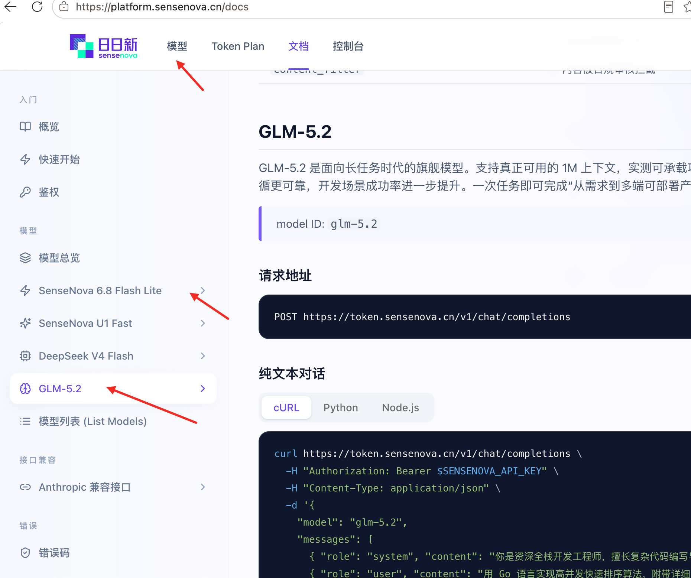
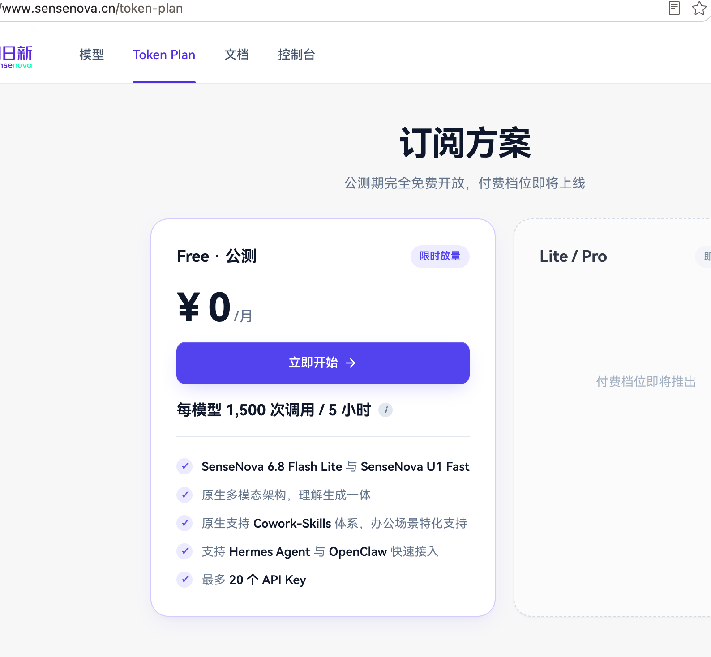

# 商汤 SenseNova

## 当前状态

- 文档状态：已整理，待实测
- API 状态：官方文档已核对
- 免费模型状态：官网 Token Plan 已核对
- 接入文档状态：OpenAI-compatible 接入已整理，agent 专用配置待实测
- 最后核验日期：2026-08-24

## 一句话说明

商汤 SenseNova 提供兼容 OpenAI API 的模型接入服务，官网 Token Plan 显示公测期间可免费使用基础模型。

## 快速开始

1. 打开商汤 SenseNova 文档。
2. 注册或登录平台并创建 API key。
3. 选择免费模型，例如 `sensenova-6.7-flash-lite`。
4. 使用 Base URL `https://token.sensenova.cn/v1`。
5. 在客户端中配置 Base URL、API key、模型名。

## 核心信息

- 官网：https://www.sensenova.cn/
- 文档：https://platform.sensenova.cn/docs
- Token Plan：https://www.sensenova.cn/token-plan
- 接入地址：https://token.sensenova.cn/v1
- Chat completions endpoint：`https://token.sensenova.cn/v1/chat/completions`
- 是否 OpenAI-compatible：是
- 免费模型：`sensenova-6.7-flash-lite`、SenseNova U1 Fast、`glm-5.2`、DeepSeek V4 Flash
- 推荐免费模型：`sensenova-6.7-flash-lite`
- 核验状态：已整理，待实测

## 图片证据

## 目录

- [官方链接](official-links.md)
- [模型列表](models.md)
- [API 接入](api.md)
- [Claude Code 接入](integrations/claude-code.md)
- [OpenClaw 接入](integrations/openclaw.md)
- [OpenCode 接入](integrations/opencode.md)
- [Codex 接入](integrations/codex.md)
- [Hermes 接入](integrations/hermes.md)
