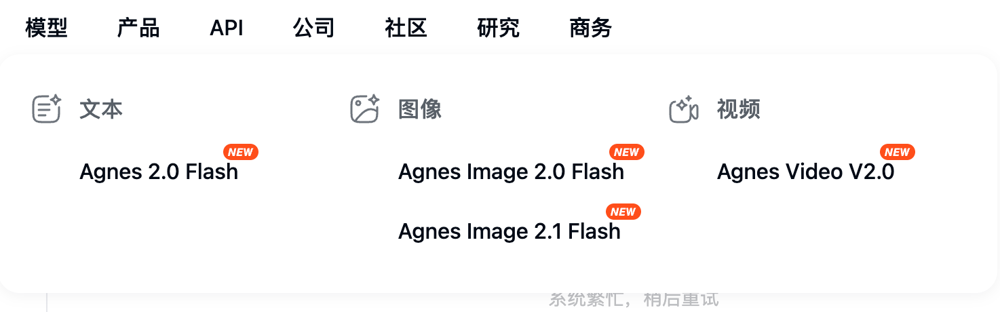

<div align="center">

# free-AI-free-token

免费 LLM 供应商、模型与 API 接入资料库

<a href="https://github.com/konglong87/free-AI-free-token"></a>
<a href="https://github.com/konglong87/free-AI-free-token/tree/main/providers"></a>
<a href="https://github.com/konglong87/free-AI-free-token"></a>

</div>

## 供应商总览

<table width="100%">
<tr>
<td width="25%"><strong>9</strong><br><sub>供应商目录</sub></td>
<td width="25%"><strong>OpenAI-compatible</strong><br><sub>优先收录</sub></td>
<td width="25%"><strong>5</strong><br><sub>固定接入文档</sub></td>
<td width="25%"><strong>2026-08-27</strong><br><sub>最后整理</sub></td>
</tr>
</table>

## 从这里开始

| 你要做什么 | 直接入口 |
| --- | --- |
| 找免费模型 | [供应商目录](#供应商目录) |
| 查 Base URL 和鉴权 | 对应目录的 `api.md` |
| 配置 Claude Code / OpenClaw / OpenCode | 对应目录的 `integrations/` |
| 新增一家供应商 | [贡献指南](docs/contribution-guide.md) |

## 供应商目录

<table width="100%">
<thead>
<tr><th width="18%">供应商</th><th width="14%">状态</th><th width="43%">推荐模型</th><th width="25%">Base URL</th></tr>
</thead>
<tbody>
<tr><td><a href="providers/agnes/">Agnes AI</a></td><td>✅</td><td><code>agnes-2.0-flash</code>、<code>agnes-2.5-flash</code></td><td><code>apihub.agnes-ai.com/v1</code></td></tr>
<tr><td><a href="providers/zhipu-glm/">智谱 GLM</a></td><td>✅</td><td><code>glm-4.7-flash</code>、<code>glm-4.6v-flash</code></td><td><code>open.bigmodel.cn/api/paas/v4</code></td></tr>
<tr><td><a href="providers/sensenova/">商汤 SenseNova</a></td><td>✅</td><td><code>sensenova-6.7-flash-lite</code>、<code>glm-5.2</code></td><td><code>token.sensenova.cn/v1</code></td></tr>
<tr><td><a href="providers/openrouter/">OpenRouter</a></td><td>✅</td><td><code>*:free</code> 模型</td><td><code>openrouter.ai/api/v1</code></td></tr>
<tr><td><a href="providers/b-ai/">B.AI</a></td><td>✅</td><td><code>DeepSeek-V4-Flash</code>、<code>Hy3</code></td><td><code>api.b.ai/v1</code></td></tr>
<tr><td><a href="providers/nvidia-nim/">NVIDIA NIM</a></td><td>🟡</td><td><code>z-ai/glm-5.2</code>、<code>poolside/laguna-xs-2.1</code></td><td><code>integrate.api.nvidia.com/v1</code></td></tr>
<tr><td><a href="providers/modelscope/">ModelScope</a></td><td>🟡</td><td><code>MiniMax/MiniMax-M2.5</code>、<code>qwen-qwen3-5-35b-a3b</code></td><td><code>api-inference.modelscope.cn/v1</code></td></tr>
<tr><td><a href="providers/groq/">Groq</a></td><td>🟡</td><td><code>moonshotai/kimi-k2-instruct</code>、<code>groq/compound</code></td><td><code>api.groq.com/openai/v1</code></td></tr>
<tr><td><a href="providers/ai21-labs/">AI21 Labs</a></td><td>🟡</td><td><code>jamba-large-1-7</code>、<code>jamba-mini-2</code></td><td><code>api.ai21.com/studio/v1</code></td></tr>
</tbody>
</table>

## 证据图片

<table width="100%">
<tr>
<td align="center" width="33%"><br><sub>Agnes AI</sub></td>
<td align="center" width="33%"><br><sub>SenseNova</sub></td>
<td align="center" width="33%"><br><sub>B.AI</sub></td>
</tr>
</table>

## 目录结构

```text
providers/<provider-slug>/
├── README.md
├── official-links.md
├── models.md
├── api.md
└── integrations/
    ├── claude-code.md
    ├── openclaw.md
    ├── opencode.md
    ├── codex.md
    └── hermes.md
```

每家供应商独立维护，详细模型能力、限流和核验状态以目录内文档为准。未实测能力统一标记为 `待核验`，不提交真实 API key、token、cookie 或账号信息。

## 新增供应商

```bash
cp -R providers/_template providers/<provider-slug>
./scripts/validate-layout.sh
```

然后填写固定文档，并在上方供应商表增加一行。来源、核验日期和状态必须可追溯。

## 文档

- [架构说明](docs/architecture.md)
- [贡献指南](docs/contribution-guide.md)
- [供应商目录](providers/)
