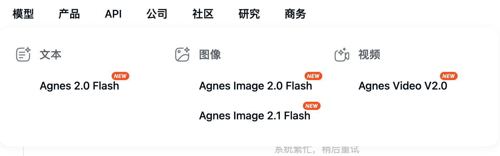
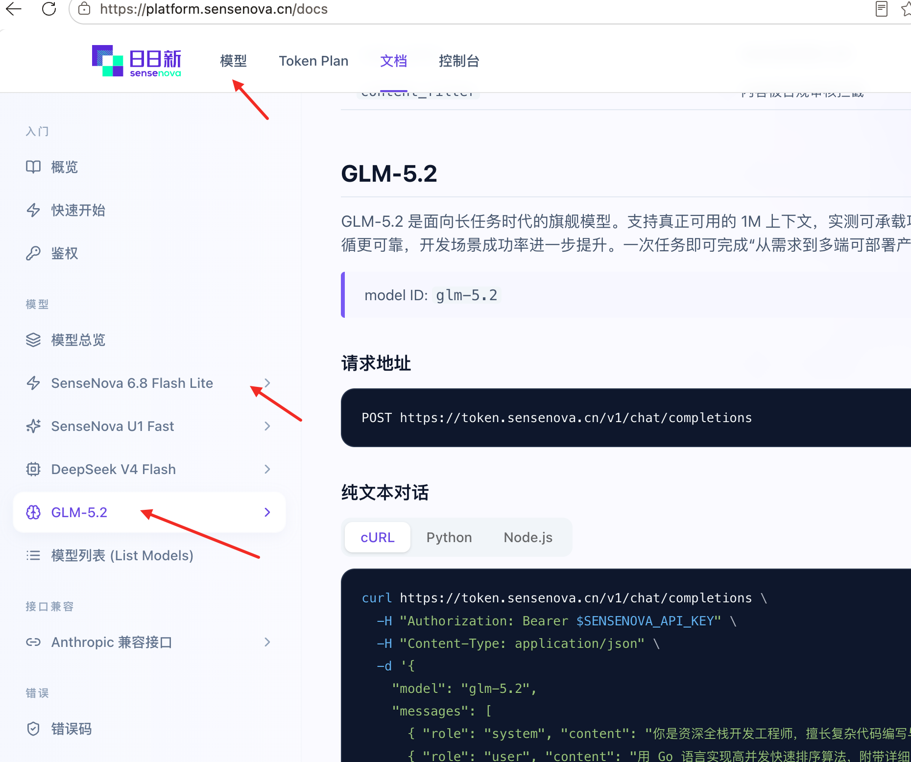
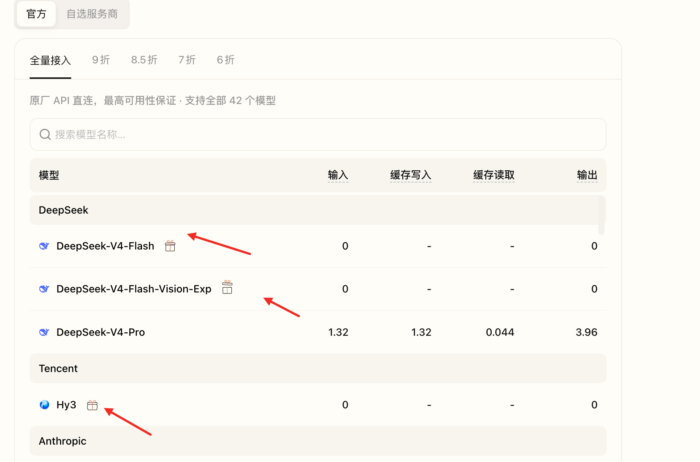

<div align="center">

# free-AI-free-token

免费 LLM 供应商、模型与 API 接入资料库

<a href="https://github.com/konglong87/free-AI-free-token"></a>
<a href="https://github.com/konglong87/free-AI-free-token/tree/main/providers"></a>
<a href="https://github.com/konglong87/free-AI-free-token"></a>

</div>

## 供应商总览

<table width="100%">
<tr>
<td width="25%"><strong>9</strong><br><sub>供应商目录</sub></td>
<td width="25%"><strong>OpenAI-compatible</strong><br><sub>优先收录</sub></td>
<td width="25%"><strong>5</strong><br><sub>固定接入文档</sub></td>
<td width="25%"><strong>2026-08-27</strong><br><sub>最后整理</sub></td>
</tr>
</table>

## 从这里开始

| 你要做什么 | 直接入口 |
| --- | --- |
| 找免费模型 | [供应商目录](#供应商目录) |
| 查 Base URL 和鉴权 | 对应目录的 `api.md` |
| 配置 Claude Code / OpenClaw / OpenCode | 对应目录的 `integrations/` |
| 新增一家供应商 | [贡献指南](docs/contribution-guide.md) |

## 供应商目录

按左侧标签找能力，再看右侧对应的模型 ID；点击供应商名称进入目录。

**理解 ≠ 生成**：👁 图片理解是看图回答；🖼 文生图 / 图生图是生成图片；🎬 文生视频 / 图生视频是生成视频。[查看标签说明](docs/model-capabilities.md)。

标签只汇总仓库已收录的模型，不代表平台全部能力或永久免费承诺；免费条件、限流和核验状态以供应商目录及官方资料为准。标注「待核验」的能力不作已确认推荐。

<table width="100%">
<thead>
<tr><th width="30%">供应商 · 免费能力</th><th width="70%">代表性模型 · 接入</th></tr>
</thead>
<tbody>
<tr>
<td valign="top"><a href="providers/agnes/"><strong>Agnes AI</strong></a><br><sub>📝 文本生成<br>👁 图片理解<br>🖼 文生图<br>🖼 图生图<br>🎬 文生视频<br>🎬 图生视频</sub></td>
<td valign="top"><strong>文本生成 · 图片理解</strong><br><code>agnes-3.0-flash</code><br><br><strong>文生图 · 图生图</strong><br><code>agnes-image-2.5-flash</code><br><br><strong>文生视频 · 图生视频</strong><br><code>agnes-video-2.5-flash</code><br><br><a href="https://apihub.agnes-ai.com/v1">API</a> · <a href="https://agnes-ai.com/">注册</a> · <a href="providers/agnes/models.md">完整模型</a><br><sub>状态：✅ · <a href="https://www.agnes-ai.com/zh-Hans/docs/pricing">官方定价</a></sub></td>
</tr>
<tr>
<td valign="top"><a href="providers/zhipu-glm/"><strong>智谱 GLM</strong></a><br><sub>📝 文本生成<br>👁 图片理解<br>🖼 文生图<br>🎬 视频生成</sub></td>
<td valign="top"><strong>文本生成</strong><br><code>glm-4.7-flash</code><br><br><strong>图片理解</strong><br><code>glm-4.6v-flash</code><br><br><strong>文生图</strong><br><code>cogview-3-flash</code><br><br><strong>视频生成</strong><br><code>cogvideox-flash</code><br><br><a href="https://open.bigmodel.cn/api/paas/v4">API</a> · <a href="https://bigmodel.cn/">注册</a> · <a href="providers/zhipu-glm/models.md">完整模型</a><br><sub>状态：✅</sub></td>
</tr>
<tr>
<td valign="top"><a href="providers/sensenova/"><strong>商汤 SenseNova</strong></a><br><sub>📝 文本生成<br>👁 图片理解</sub></td>
<td valign="top"><strong>文本生成 · 图片理解</strong><br><strong>DeepSeek V4.1 Flash</strong><br><code>deepseek-flash</code><br><strong><code>kimi-k3</code></strong><br><br><a href="https://token.sensenova.cn/v1">API</a> · <a href="https://www.sensenova.cn/">注册</a> · <a href="providers/sensenova/models.md">完整模型</a><br><sub>状态：✅ · <a href="https://platform.sensenova.cn/docs">官方文档</a></sub></td>
</tr>
<tr>
<td valign="top"><a href="providers/openrouter/"><strong>OpenRouter</strong></a><br><sub>📝 文本生成</sub></td>
<td valign="top"><strong>文本生成</strong><br><code>*:free</code> 模型（能力随具体模型变化）<br><br><a href="https://openrouter.ai/api/v1">API</a> · <a href="https://openrouter.ai/">注册</a> · <a href="providers/openrouter/models.md">完整模型</a><br><sub>状态：✅</sub></td>
</tr>
<tr>
<td valign="top"><a href="providers/b-ai/"><strong>B.AI</strong></a><br><sub>📝 文本生成<br>👁 图片理解<br>（待核验）</sub></td>
<td valign="top"><strong>文本生成</strong><br><code>DeepSeek-V4-Flash</code><br><code>Hy3</code><br><br><strong>文本生成 · 图片理解（待核验）</strong><br><code>DeepSeek-V4-Flash-Vision-Exp</code><br><br><a href="https://api.b.ai/v1">API</a> · <a href="https://chat.b.ai/">注册</a> · <a href="providers/b-ai/models.md">完整模型</a><br><sub>状态：✅ · <a href="providers/b-ai/assets/b-ai-free-models.png">模型截图</a></sub></td>
</tr>
<tr>
<td valign="top"><a href="providers/nvidia-nim/"><strong>NVIDIA NIM</strong></a><br><sub>📝 文本生成</sub></td>
<td valign="top"><strong>文本生成</strong><br><code>z-ai/glm-5.2</code><br><code>poolside/laguna-xs-2.1</code><br><br><a href="https://integrate.api.nvidia.com/v1">API</a> · <a href="https://build.nvidia.com/">注册</a> · <a href="providers/nvidia-nim/models.md">完整模型</a><br><sub>状态：🟡</sub></td>
</tr>
<tr>
<td valign="top"><a href="providers/modelscope/"><strong>ModelScope</strong></a><br><sub>📝 文本生成</sub></td>
<td valign="top"><strong>文本生成</strong><br><code>MiniMax/MiniMax-M2.5</code><br><code>qwen-qwen3-5-35b-a3b</code><br><br><a href="https://api-inference.modelscope.cn/v1">API</a> · <a href="https://modelscope.cn/">注册</a> · <a href="providers/modelscope/models.md">完整模型</a><br><sub>状态：🟡</sub></td>
</tr>
<tr>
<td valign="top"><a href="providers/groq/"><strong>Groq</strong></a><br><sub>📝 文本生成</sub></td>
<td valign="top"><strong>文本生成</strong><br><code>moonshotai/kimi-k2-instruct</code><br><code>groq/compound</code><br><br><a href="https://api.groq.com/openai/v1">API</a> · <a href="https://console.groq.com/">注册</a> · <a href="providers/groq/models.md">完整模型</a><br><sub>状态：🟡</sub></td>
</tr>
<tr>
<td valign="top"><a href="providers/ai21-labs/"><strong>AI21 Labs</strong></a><br><sub>📝 文本生成</sub></td>
<td valign="top"><strong>文本生成</strong><br><code>jamba-large-1-7</code><br><code>jamba-mini-2</code><br><br><a href="https://api.ai21.com/studio/v1">API</a> · <a href="https://studio.ai21.com/">注册</a> · <a href="providers/ai21-labs/models.md">完整模型</a><br><sub>状态：🟡</sub></td>
</tr>
</tbody>
</table>

## 证据图片

<table width="100%">
<tr>
<td align="center" width="33%"><br><sub>Agnes AI</sub></td>
<td align="center" width="33%"><br><sub>SenseNova</sub></td>
<td align="center" width="33%"><br><sub>B.AI</sub></td>
</tr>
</table>

## 目录结构

```text
providers/<provider-slug>/
├── README.md
├── official-links.md
├── models.md
├── api.md
└── integrations/
    ├── claude-code.md
    ├── openclaw.md
    ├── opencode.md
    ├── codex.md
    └── hermes.md
```

每家供应商独立维护，详细模型能力、限流和核验状态以目录内文档为准。未实测能力统一标记为 `待核验`，不提交真实 API key、token、cookie 或账号信息。

## 新增供应商

```bash
cp -R providers/_template providers/<provider-slug>
./scripts/validate-layout.sh
```

然后填写固定文档，并在上方供应商表增加一行。来源、核验日期和状态必须可追溯。

## 文档

- [架构说明](docs/architecture.md)
- [贡献指南](docs/contribution-guide.md)
- [供应商目录](providers/)
